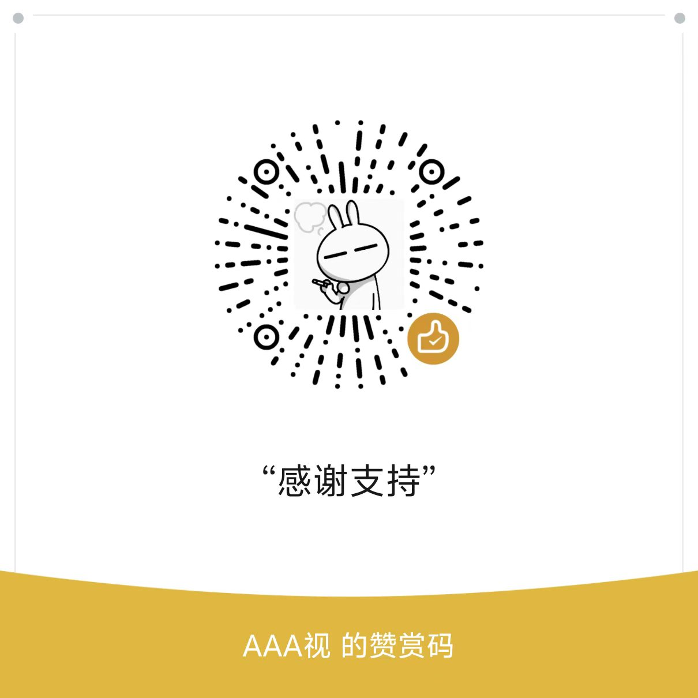

# 学习通自动刷课脚本（单文件版）

[](LICENSE)
[](https://nodejs.org)
[](package.json)
[](https://github.com/ZHE-you/Chaoxingxuexitong-ayto/actions/workflows/verify.yml)

> ⚠️ **免责声明**：本项目仅用于脚本调试、前端自动化研究与页面行为分析，请遵守目标平台（学习通 / 超星）的使用规定，勿用于违规用途。因使用本脚本产生的任何后果由使用者自行承担。

自动播放学习通课程视频、视频结束后自动切换到下一小节，并在页面结构异常（章节测验、无视频课件等）时安全停止，避免循环跳转。

**整个项目只有一个脚本文件 [`xuexitong.user.js`](xuexitong.user.js)**：它既能直接粘贴到浏览器控制台运行，也能作为 Tampermonkey 油猴脚本导入（文件顶部的 `// ==UserScript==` 元信息头在控制台里只是注释，不影响运行）。

## ✨ 特性

- **自动播放**：识别 iframe 内的真实 `<video>` 元素并自动 `play()`
- **断点恢复**：播放被中断或卡住时自动恢复（含静音兜底）
- **自动续播**：视频结束后在课程目录树中定位并点击下一小节
- **学习步骤接管**：从“学习目标”步骤自动切到“视频”步骤；手动点击“视频”页签后自动重新接管
- **章节测验保护**：受限跳转（最多 3 次），防止页面循环
- **无视频页安全停止**：默认不自动跳过无法识别的课件页，避免触发平台“任务未完成”提示（可手动或配置开启）
- **单文件零构建**：无需任何构建步骤，一份源码同时服务于控制台与油猴

## 📁 目录结构

```text
.
├── xuexitong.user.js     # 唯一脚本文件：控制台 + 油猴通用
├── tests/
│   └── verify-v3.mjs     # 语法校验（node --check）
├── img/                  # 文档截图与赞赏码
├── archive/              # 历史版本（v2 / 旧版）及旧文档
│   ├── v2.js
│   ├── xuexitong.js
│   └── README_v2.md
├── ISSUES_REVIEW.md      # 历史 issue 复盘与优化记录
├── package.json
├── LICENSE
└── .github/workflows/    # CI：单文件语法校验
```

## 🚀 使用方法

### 方法一：控制台执行（推荐快速验证）

1. 打开学习通课程播放页
2. 按 `F12` 打开开发者工具，进入 `Console` 面板
3. 复制 [`xuexitong.user.js`](xuexitong.user.js) 的**全部内容**，粘贴并执行
4. 首次执行后，可在控制台使用以下命令重新接管：

```javascript
app.run();        // 重新初始化并播放（刷新页面 / 手动切换小节后调用）
app.nextUnit();   // 手动切换到下一小节
```

> 文件顶部的 `// ==UserScript== ... // ==/UserScript==` 只是注释，粘贴进控制台会被忽略，无需删改。

### 方法二：Tampermonkey 油猴

1. 安装 [Tampermonkey](https://www.tampermonkey.net/) 浏览器扩展
2. 将 [`xuexitong.user.js`](xuexitong.user.js) 拖入浏览器窗口，或在其管理面板“添加新脚本”里粘贴保存
3. 确认脚本已启用，刷新学习通播放页面即可自动运行

> 油猴版通过 `@require` 加载 jQuery，无需手动引入；控制台版会在运行时自动注入 jQuery。

## ⚙️ 配置说明

脚本顶部 `configs` 可调整行为（直接修改 `xuexitong.user.js` 后重新执行 / 重新导入即可）：

| 配置项 | 默认值 | 说明 |
| --- | --- | --- |
| `playbackRate` | `1.5` | 播放倍速（平台可能服务端限制最高倍速） |
| `autoplay` | `true` | 加载完成后是否自动播放 |
| `retryInterval` | `2000` | 播放失败后的重试间隔（毫秒） |
| `maxRetries` | `10` | 最大重试次数 |
| `videoCheckInterval` | `1000` | 视频状态轮询间隔（毫秒） |
| `guardNoProgressMs` | `7000` | 判定“卡住无进度”的阈值（毫秒） |
| `guardResumeCooldownMs` | `1500` | 恢复播放的冷却时间（毫秒） |
| `autoAdvanceNoVideo` | `false` | 是否在无视频小节自动切换（默认关闭，安全起见） |

将 `autoAdvanceNoVideo` 改为 `true` 可让脚本自动跳过无视频小节（请先确认课程结构安全）。

## 🔧 校验

本仓库零运行时依赖（仅用 Node 内置模块），要求 **Node.js ≥ 20.11**。修改脚本后可用以下命令做语法校验：

```bash
npm test            # 等价于 node tests/verify-v3.mjs
```

CI（`.github/workflows/verify.yml`）在每次 push / PR 时自动执行该校验。

## ❓ 常见问题

**Q：为什么有时控制台会报 `AbortError`？**
`The play() request was interrupted by a call to pause()` 通常不是视频损坏，而是页面初始化或平台重置播放状态时产生的瞬时中断。脚本会优先尝试恢复播放，而非判定失败。

**Q：为什么日志会重复出现？**
同一页面反复粘贴执行脚本，会导致监听器与定时器叠加。请刷新页面后只执行一次；使用油猴版时不要再在控制台重复粘贴。

**Q：为什么“无视频/课件”页不会自动跳过？**
默认 `autoAdvanceNoVideo = false`，避免在课件未完成时反复触发平台的“当前章节还有任务未完成”提示。确认安全后可手动 `app.nextUnit()` 或开启该配置。

**Q：倍速 / 任务点不被接受？**
平台可能服务端强制倍速与完成情况，本脚本不尝试绕过，这属于平台限制。

## 📜 历史版本

旧版实现（v2 及更早）已归档在 [`archive/`](archive/) 目录，仅供对照参考，不再维护。详细的问题复盘见 [`ISSUES_REVIEW.md`](ISSUES_REVIEW.md)。

## ❤️ 支持作者

本项目完全免费开源，脚本会持续跟进学习通页面结构的变化。如果它帮你省下了时间，欢迎请作者喝杯咖啡 ☕，你的支持是持续维护的最大动力。

<div align="center">



**感谢支持**

</div>

> 赞赏纯属自愿，与功能使用无关；不开赞赏同样可以使用全部功能。

## 📄 许可证

[MIT](LICENSE) © 2026 xuexitongScript contributors
